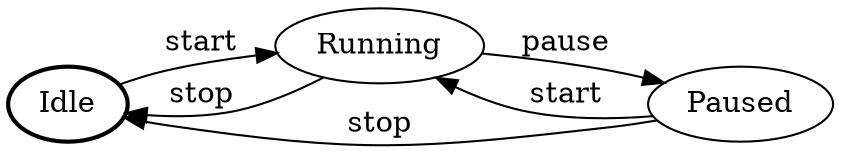

# FSM (Finite State Machine)

The FSM module provides a finite state machine with named states, event-driven transitions, guards, actions, history tracking, thread safety, and Graphviz DOT export. It's ideal for modeling application states, device control flows, and game logic.

## Overview

A finite state machine consists of **states** connected by **transitions**. Transitions are triggered by **events** and can be conditionally guarded. The FSM tracks transition history and can export its graph for visualization.

```cpp
#include <xtils/fsm/fsm.h>

using namespace xtils::fsm;

enum Event : EventType {
  START = 1,
  PAUSE = 2,
  STOP = 3,
};

FSM fsm;

// Register human-readable event names
fsm.RegisterEvent(START, "start");
fsm.RegisterEvent(PAUSE, "pause");
fsm.RegisterEvent(STOP, "stop");

// Define states
fsm.AddState("Idle", [](const State&, EventType) { LogI("→ Idle"); });
fsm.AddState("Running", [](const State&, EventType) { LogI("→ Running"); });
fsm.AddState("Paused", [](const State&, EventType) { LogI("→ Paused"); });

// Define transitions
fsm.AddTransition("Idle", "Running", START);
fsm.AddTransition("Running", "Paused", PAUSE);
fsm.AddTransition("Paused", "Running", START);
fsm.AddTransition("Running", "Idle", STOP);
fsm.AddTransition("Paused", "Idle", STOP);

// Run
fsm.Start("Idle");
fsm.ProcessEvent(START);  // Idle → Running
fsm.ProcessEvent(PAUSE);  // Running → Paused
fsm.ProcessEvent(START);  // Paused → Running
```

## Header

```cpp
#include "xtils/fsm/fsm.h"
```

## State Management

```cpp
// Add states with optional callbacks
StateId AddState(std::unique_ptr<State> state);
StateId AddState(const std::string& name);
StateId AddState(const std::string& name, StateCallback on_enter);
StateId AddState(const std::string& name, StateCallback on_enter, StateCallback on_exit);
```

The `StateCallback` signature is:

```cpp
using StateCallback = std::function<void(const State& state, EventType triggering_event)>;
```

## Transitions

```cpp
// Single event trigger
void AddTransition(const std::string& from, const std::string& to,
                   EventType event, TransitionConditionPtr condition = nullptr);

// Multiple events trigger the same transition
void AddTransition(const std::string& from, const std::string& to,
                   std::vector<EventType> events, TransitionConditionPtr condition = nullptr);

// By state ID
void AddTransition(StateId from, StateId to, EventType event,
                   TransitionConditionPtr condition = nullptr);
```

## Control

```cpp
void Start(const std::string& initial_state);   // Start the FSM
void Start(StateId initial_state_id);
void Reset(const std::string& state_name);      // Force state (no callbacks)
void Reset(StateId state_id);
void ProcessEvent(EventType event);             // Trigger transition
```

## Queries

```cpp
bool IsInState(const std::string& name) const;
bool IsInState(StateId id) const;
std::optional<std::string> GetCurrentStateName() const;
std::optional<StateId> GetCurrentStateId() const;
std::optional<StateId> GetStateId(const std::string& name) const;
```

## Transition Conditions (Guards & Actions)

Guards block transitions if they return `false`. Actions execute when a transition fires. You can combine both:

```cpp
using TransitionGuard = std::function<bool(const State& from, const State& to, EventType)>;
using TransitionAction = std::function<void(const State& from, const State& to, EventType)>;

// Create a guard
auto guard = MakeGuard("name", [](const State& from, const State& to, EventType evt) {
  return /* condition */;
});

// Create an action
auto action = MakeAction("name", [](const State& from, const State& to, EventType evt) {
  // side effect on transition
});

// Combined guard + action
auto cond = MakeCondition("name", guard_fn, action_fn);
```

### Example: Guarded Transition

```cpp
// Only allow start if battery > 20%
fsm.AddTransition("Idle", "Running", START,
    MakeGuard("battery_check", [&](const State&, const State&, EventType) {
      return battery_level > 20;
    }));

// Log on transition
fsm.AddTransition("Running", "Idle", STOP,
    MakeAction("log_stop", [](const State&, const State&, EventType) {
      LogI("Machine stopped");
    }));
```

## Event Registration

Register human-readable names for events. These names appear in history entries and DOT graph output:

```cpp
void RegisterEvent(EventType event, const std::string& name);
std::string GetEventName(EventType event) const;
```

## History

The FSM records all transition attempts in a deque:

```cpp
std::deque<HistoryEntry> GetHistory() const;  // Returns a copy (thread-safe)
void ClearHistory();
void SetMaxHistorySize(size_t max_size);
void SetRecordFailedEvents(bool record);  // Record events that didn't trigger transitions
std::string DumpHistory() const;          // Formatted multi-line dump
```

### `HistoryEntry`

```cpp
struct HistoryEntry {
  std::int64_t timestamp;      // Wall clock (ms since Unix epoch)
  StateId from_state;
  StateId to_state;
  EventType event;
  bool transition_occurred;    // false if guard blocked it
  std::string from_name;       // Human-readable source state
  std::string to_name;         // Human-readable target state
  std::string event_name;      // Human-readable event name
  std::string description;     // Optional description
  std::string toString() const;
};
```

### Example: History Inspection

```cpp
fsm.SetRecordFailedEvents(true);
fsm.SetMaxHistorySize(100);

// After some events...
auto history = fsm.GetHistory();
for (auto& entry : history) {
  LogI("%s", entry.toString().c_str());
}

// Or use DumpHistory() for formatted output
LogI("\n%s", fsm.DumpHistory().c_str());
```

## Thread Safety

By default the FSM is not thread-safe. Enable thread safety when multiple threads call `ProcessEvent`:

```cpp
fsm.EnableThreadSafety(true);  // Uses recursive_mutex internally
```

::: warning
`GetHistory()` returns by **value** (a copy) to avoid races. Do not cache references to the internal history.
:::

## Graphviz DOT Export

Export the FSM graph for visualization with Graphviz or online tools:

```cpp
std::string dot = fsm.ToDotGraph();
// Render with: dot -Tpng fsm.dot -o fsm.png
```

Output example:


## State Class

For custom state behavior, subclass `State`:

```cpp
class State {
 public:
  State(const std::string& name);
  State(const std::string& name, StateCallback on_enter);
  State(const std::string& name, StateCallback on_enter, StateCallback on_exit);
  State(const std::string& name, StateCallback on_enter, StateCallback on_exit, StateCallback on_update);

  const std::string& name() const;
  StateId id() const;
  virtual void onEnter(EventType triggering_event);
  virtual void onExit(EventType triggering_event);
  virtual void onUpdate(EventType triggering_event);
};
```

## Complete Example

```cpp
#include <xtils/fsm/fsm.h>
#include <xtils/logging/logger.h>

using namespace xtils::fsm;

enum LightEvent : EventType {
  TURN_ON = 1,
  TURN_OFF = 2,
  DIM = 3,
  BRIGHTEN = 4,
};

FSM light;

// Register events
light.RegisterEvent(TURN_ON, "turn_on");
light.RegisterEvent(TURN_OFF, "turn_off");
light.RegisterEvent(DIM, "dim");
light.RegisterEvent(BRIGHTEN, "brighten");

// States with enter/exit callbacks
light.AddState("Off",
  [](const State&, EventType) { LogI("Light OFF"); },
  [](const State&, EventType) { LogI("Leaving OFF"); });
light.AddState("On",
  [](const State&, EventType) { LogI("Light ON (full)"); });
light.AddState("Dimmed",
  [](const State&, EventType) { LogI("Light DIMMED"); });

// Transitions
light.AddTransition("Off", "On", TURN_ON);
light.AddTransition("On", "Off", TURN_OFF);
light.AddTransition("Dimmed", "Off", TURN_OFF);
light.AddTransition("On", "Dimmed", DIM);
light.AddTransition("Dimmed", "On", BRIGHTEN);

// Enable history
light.SetMaxHistorySize(50);
light.EnableThreadSafety(true);

// Run
light.Start("Off");
light.ProcessEvent(TURN_ON);   // Off → On
light.ProcessEvent(DIM);       // On → Dimmed
light.ProcessEvent(BRIGHTEN);  // Dimmed → On
light.ProcessEvent(TURN_OFF);  // On → Off

// Inspect
LogI("Current state: %s", light.GetCurrentStateName()->c_str());
LogI("DOT graph:\n%s", light.ToDotGraph().c_str());
LogI("History:\n%s", light.DumpHistory().c_str());
```
